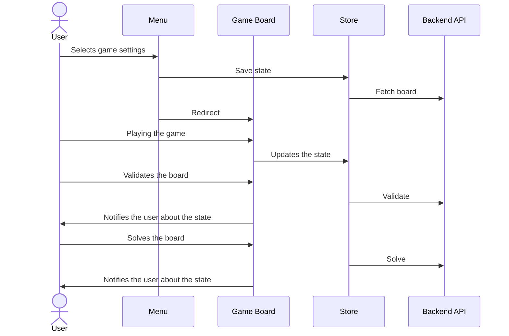

# SudokuUi

This is the documentation of the sudoku client site application.

## To start

Just clone the the repository and install the dependencies by:

```bash
npm i
```

And start the development server with:

```bash
npm start
```

OR

Just play with the deployed version: https://github.com/Vibeasd/sudoku-ui

## Requirements

-   Choose a difficulty for the board (easy/medium/hard/random) and then start the game.
-   Enter numbers in the empty squares (not allowed to change the prefilled squares)
-   Have a “Validate” button to verify if they have solved it.
-   Have a “Solve” button that auto-solves the puzzle.

## How it works?


